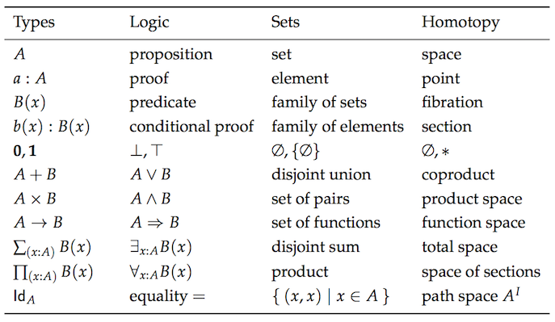

#代码组合(compose)

##函数饲养( Functional husbandry)


Here's `compose`:

```js
var compose = function(f, g) {
  return function(x) {
    return f(g(x));
  };
};
```

`f`和`g`是函数,`x`是在它们之间通过`管道`传输的值

`组合`看起来像是在饲养函数。你是函数的饲养员,选择两个有特点有让你喜欢的函数,让它们结合在一起产生下一个信的函数。用法如下:

```js
var toUpperCase = function(x) {
  return x.toUpperCase();
};
var exclaim = function(x) {
  return x + '!';
};
var shout = compose(exclaim, toUpperCase);

shout("send in the clowns");
//=> "SEND IN THE CLOWNS!"
```

两个函数组合形成新的函数。这说得通,组合某些种类型的连个元素本就该生成一个该类型的新元素,把两个Legos积木拼起来肯定不得到Lincoln积木。所以这是有道理的。

在`compose`的定义中,`g`将先于`f`被执行,因此就创建了一个从左倒油的数据流。这样做的可读性高于嵌套一堆函数调用。没有组合,上面的`shout`会是这样的:

```js
var shout = function(x) {
  return exclaim(toUpperCase(x));
};
```

我们然代码从右向左执行,而不是从内向外执行。我认为可以称之为`左倾`(吁/~/~很符合我党的作风。。。。)。让我们来看一个顺序很重要的例子:

```js
var head = function(x) {
  return x[0];
};
var reverse = reduce(function(acc, x) {
  return [x].concat(acc);
}, []);
var last = compose(head, reverse);

last(['jumpkick', 'roundhouse', 'uppercut']);
//=> 'uppercut'
```

`reverse`将反转list,`head`取列表中的第一个元素。所以结果就是得到来一个`last`函数。虽然性能不高。这种组合中函数执行顺序应该是显而易见的。尽管我们可以定义一个从左向右的版本,然而从右向左执行更加能够反应数学上的含义。是的,组合的概念直接是来自于数学课本。事实上,现在是时候去看看所有的组合都有的一个特性了。

```js
// associativity
var associative = compose(f, compose(g, h)) == compose(compose(f, g), h);
// true
```

这个特性是结合律,意味着不管你是把它们中的哪两个分成一组都无所谓。所以我,如果我们想把字符串变成大写可以这么写:

```js
compose(toUpperCase, compose(head, reverse));

// or
compose(compose(toUpperCase, head), reverse);
```

因为如何为`compose`分组这不重要,所以结果都是一样的。这也让我们有能力写一个可变的组合)(variadic compose),如下:

```js
// previously we'd have to write two composes, 
//but since it's associative, 
//we can give compose as many fn's as we like and let it decide how to group them.
var lastUpper = compose(toUpperCase, head, reverse);

lastUpper(['jumpkick', 'roundhouse', 'uppercut']);
//=> 'UPPERCUT'


var loudLastUpper = compose(exclaim, toUpperCase, head, reverse);

loudLastUpper(['jumpkick', 'roundhouse', 'uppercut']);
//=> 'UPPERCUT!'
```

应用结合律能给我们代理强大的灵活性还有对执行结果不会出现意外对平和心态。

结合律对一个好处就是任何一个函数分组都可以被拆开来,然后再以它们自己的组合方式打包在一起。我们重构上面的的例子

```js
var loudLastUpper = compose(exclaim, toUpperCase, head, reverse);

// or
var last = compose(head, reverse);
var loudLastUpper = compose(exclaim, toUpperCase, last);

// or
var last = compose(head, reverse);
var angry = compose(exclaim, toUpperCase);
var loudLastUpper = compose(angry, last);

// more variations...
```

关于如何足额和并没有一标准的答案,我们只是以自己喜欢的方式来搭建乐高积木。通常来说,最佳实践是让组合可以重用,就像`last`和`angry`那样。如果熟悉Fowler的《[重构](http://martinfowler.com/books/refactoring.html)》一书,你可能会认识到这个过程叫做"extract method"——只不过不需要关心对象的状态。

## Pointfree

pointfree 模式指的是，永远不必说出你的数据。咳咳对不起（译者注：此处原文是“Pointfree style means never having to say your data”，源自 1970 年的电影 Love Story 里的一句著名台词“Love means never having to say you're sorry”。紧接着作者又说了一句“Excuse me”，大概是一种幽默）。它的意思是说，函数无须提及将要操作的数据是什么样的。一等公民的函数、柯里化（curry）以及组合协作起来非常有助于实现这种模式。

```js
//not pointfree because we mention the data: word
var snakeCase = function(word) {
  return word.toLowerCase().replace(/\s+/ig, '_');
};

//pointfree
var snakeCase = compose(replace(/\s+/ig, '_'), toLowerCase);
```

看到`replace`是如何被调用的? 这里所做的事情就是通过管道吧数据在接手单个参数的函数间传递。利用`curry`,我们能够让每个函数现接收到数据,最后把数据传到下一个函数哪里去。另外注意`pointfree`版本中,不需要`word`参数就能构造函数,而非`pointfree`版本中,必须有`word`才能进行一切操作。

看看另一个例子:

```js
//not pointfree because we mention the data: name
var initials = function(name) {
  return name.split(' ').map(compose(toUpperCase, head)).join('. ');
};

//pointfree
var initials = compose(join('. '), map(compose(toUpperCase, head)), split(' '));

initials("hunter stockton thompson");
// 'H. S. T'
```


另外，`pointfree`模式能够帮助我们减少不必要的命名，让代码保持简洁和通用。对函数式代码来说，`pointfree` 是非常好的石蕊试验(litmus test)，因为它能告诉我们一个函数是否是接受输入返回输出的小函数。比如，`while` 循环是不能组合的。不过你也要警惕，`pointfree` 就像是一把双刃剑，有时候也能混淆视听。并非所有的函数式代码都是 `pointfree` 的，不过这没关系。可以使用它的时候就使用，不能使用的时候就用普通函数。


## Debugging

组合的以常见就是,在没有局部调用之前,就组合类似`map`这样两个参数的函数。
A common mistake is to compose something like `map`, a function of two arguments, without first partially applying it.

```js
//wrong - we end up giving angry an array and we partially applied map with god knows what.

var latin = compose(map, angry, reverse);

latin(['frog', 'eyes']);
// error


// right - each function expects 1 argument.
var latin = compose(map(angry), reverse);

latin(['frog', 'eyes']);
// ['EYES!', 'FROG!'])
```

如果在debug组合的时候遇到混到,我们可以使用下面这个有效的,但是不纯的`trace`函数来追踪代码的执行情况。

```js
var trace = curry(function(tag, x) {
  console.log(tag, x);
  return x;
});

var dasherize = compose(join('-'), toLower, split(' '), replace(/\s{2,}/ig, ' '));

dasherize('The world is a vampire');
// TypeError: Cannot read property 'apply' of undefined
```

这里报错来,来`trace`下。

```js
var dasherize = compose(join('-'), toLower, trace('after split'), split(' '), replace(/\s{2,}/ig, ' '));
// after split [ 'The', 'world', 'is', 'a', 'vampire' ]
```

哈~`toLower`的参数是个数组,所以需要先用`map`调用一下它。

```js
var dasherize = compose(join('-'), map(toLower), split(' '), replace(/\s{2,}/ig, ' '));

dasherize('The world is a vampire');

// 'the-world-is-a-vampire'
```

`trace`函数允许我们在某个特定的点观察数据来`debug`。像`haskell`和`purescript`之类的


组合将成为我们构造程序的工具，而且幸运的是，它背后是有一个强大的理论做支撑的。让我们来研究研究这个理论。


## 范畴学

范畴学是数学中的一个抽象分支。能够形式化诸如集合论(set theory)、类型论(type theory)、群论(group theory)以及逻辑学(logic)等数学分支的一些概念。范畴学主要处理对象(object)、态射(morphism)和变化式(transformation),而这些概念和编程联系非常紧密。
下图是一些相同的概念分别在不同理论下的形式:



抱歉,我没有要吓唬你的意思。我不期望你对这些概念了如指掌。我就是像让你明白这里有多说重复内容,然你知道为何范畴学要统一这些概念。

在范畴学中,有一个概念叫做 `范畴`。有着以下这些组件(component)的集合`collection`就构成来一个范畴

  - 对象(object)的集合
  - 态射(morphism)的集合
  - 态射的组合
  - `identity`这个独特的态射

范畴学抽象到足以模拟任何事物,不过目前我们最关心的还是类型和函数,所以让我们把范畴学运用到它们身上看看

**对象的集合**
对象就是数据的类型。例如`String`,`Boolean`,`Number`,`Object`等等。我们通常把数据类型视作所有可能的值的一个集合(set)。像`Boolean`可以看作`[true,false]`的集合,`Number`可以是所有实数的集合。把类型当作集合对待是有好处的,因为我们可以利用`集合论(set theory)`处理类型。


**态射的集合**
态射是标准的、普通的纯函数

**态射的组合**
我们已经讨论过`compose`函数是符合结合律的,这并非巧合,结合律是范畴学中对任何组合都使用对一个特性

这张图展示了什么是组合


这有一个具体对例子

```js
var g = function(x) {
  return x.length;
};
var f = function(x) {
  return x === 4;
};
var isFourLetterWord = compose(f, g);
```

**Identity这个独特的态射**
让我们介绍一下这个名为`id`的实用函数。这个函数接受随便什么输入然后原封不动的返回它:

```js
var id = function(x) {
  return x;
};
```

你可能会问"这特么有毛用啊!!!"。别急,我们会在随后的文章中拓展这个函数,暂时先把它当作一个可以替代给定值的函数——一个假装自己是普通数据的函数。

`id`函数和组合一起使用简直完美。下面和这个特性对所有对一元函数(unary function)`f`都成立:

```js
// identity
compose(id, f) == compose(f, id) == f;
// true
```

嘿!这就是实数对单位元(identity property)嘛!如果还不够清楚直白,别急。慢慢理解它的无用性。很快我们就会到处使用`id`了,不过暂时我们还是把它当作一个替代给定值的函数。这对写`pointfree`对代码非常有用。

好了，以上就是类型和函数的范畴。不过如果你是第一次听说这些概念，我估计你还是有些迷糊，不知道范畴到底是什么，为什么有用。没关系，本书全书都在借助这些知识编写示例代码。至于现在，就在本章，本行文字中，你至少可以认为它向我们提供了有关组合的知识——比如结合律和单位律。

除了类型和函数,还有什么范畴呢?还有很多,比如我们可以定义一个有向图(directed graph),以节点为对象,以变为边态射。以路径链接为组合。还可以定义一个实数类型（Number），以所有的实数对象，以 `>=` 为态射（实际上任何偏序（partial order）或全序（total order）都可以成为一个范畴）。范畴的总数是无限的，但是要达到本书的目的，我们只需要关心上面定义的范畴就好了。至此我们已经大致浏览了一些表面的东西，必须要继续后面的内容了。


## 总结
组合像一系列管道那样把不同的函数联系在一起，数据就可以也必须在其中流动——毕竟纯函数就是输入对输出，所以打破这个链条就是不尊重输出，就会让我们的应用一无是处。

我们认为组合是高于其他所有原则的设计原则，这是因为组合让我们的代码简单而富有可读性。另外范畴学将在应用架构、模拟副作用和保证正确性方面扮演重要角色。


## Exercises

```js
var _ = require('ramda');
var accounting = require('accounting');

// Example Data
var CARS = [{
  name: 'Ferrari FF',
  horsepower: 660,
  dollar_value: 700000,
  in_stock: true,
}, {
  name: 'Spyker C12 Zagato',
  horsepower: 650,
  dollar_value: 648000,
  in_stock: false,
}, {
  name: 'Jaguar XKR-S',
  horsepower: 550,
  dollar_value: 132000,
  in_stock: false,
}, {
  name: 'Audi R8',
  horsepower: 525,
  dollar_value: 114200,
  in_stock: false,
}, {
  name: 'Aston Martin One-77',
  horsepower: 750,
  dollar_value: 1850000,
  in_stock: true,
}, {
  name: 'Pagani Huayra',
  horsepower: 700,
  dollar_value: 1300000,
  in_stock: false,
}];

// Exercise 1:
// ============
// Use _.compose() to rewrite the function below. Hint: _.prop() is curried.
var isLastInStock = function(cars) {
  var last_car = _.last(cars);
  return _.prop('in_stock', last_car);
};

//answer:

var isLastInStock = _.compose(_.prop('in_stock'),_.last);

// Exercise 2:
// ============
// Use _.compose(), _.prop() and _.head() to retrieve the name of the first car.
var nameOfFirstCar = undefined;

//answer:
var nameOfFirstCar = _.compose(_.prop('name'),_.head);


// Exercise 3:
// ============
// Use the helper function _average to refactor averageDollarValue as a composition.
var _average = function(xs) {
  return _.reduce(_.add, 0, xs) / xs.length;
}; // <- leave be

var averageDollarValue = function(cars) {
  var dollar_values = _.map(function(c) {
    return c.dollar_value;
  }, cars);
  return _average(dollar_values);
};


//answer:
var anverageDollarValue = _.compose(_average,_.map(_.prop('dollar_value')));


// Exercise 4:
// ============
// Write a function: sanitizeNames() using compose that returns a list of lowercase and underscored car's names: e.g: sanitizeNames([{name: 'Ferrari FF', horsepower: 660, dollar_value: 700000, in_stock: true}]) //=> ['ferrari_ff'].

var _underscore = _.replace(/\W+/g, '_'); //<-- leave this alone and use to sanitize

var sanitizeNames = undefined;

//answer:
var sanitizeNames = _.map(_.compose(_underscore,toLowerCase,_.prop('name')));

// Bonus 1:
// ============
// Refactor availablePrices with compose.

var availablePrices = function(cars) {
  var available_cars = _.filter(_.prop('in_stock'), cars);
  return available_cars.map(function(x) {
    return accounting.formatMoney(x.dollar_value);
  }).join(', ');
};

//answer:
var availablePrices = _.compose(join(', '),_.map(fromatPrice),_filter(_.prop('in_stock')));

// Bonus 2:
// ============
// Refactor to pointfree. Hint: you can use _.flip().

var fastestCar = function(cars) {
  var sorted = _.sortBy(function(car) {
    return car.horsepower;
  }, cars);
  var fastest = _.last(sorted);
  return fastest.name + ' is the fastest';
};

//answer:
var append = _.flip(_.concat);

var fastestCar = _.compose(append('is the fastes'),
                           _.prop('name'),
                           _.last,
                           _.sortBy(_.prop('horsepower')));
```

[lodash-website]: https://lodash.com/
[underscore-website]: http://underscorejs.org/
[ramda-website]: http://ramdajs.com/
[refactoring-book]: http://martinfowler.com/books/refactoring.html
[extract-method-refactor]: http://refactoring.com/catalog/extractMethod.html
